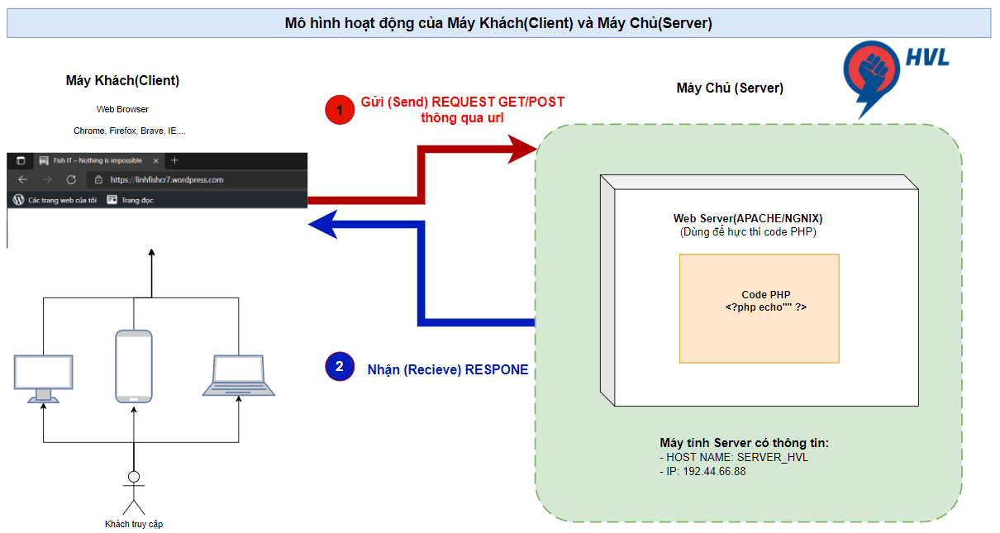
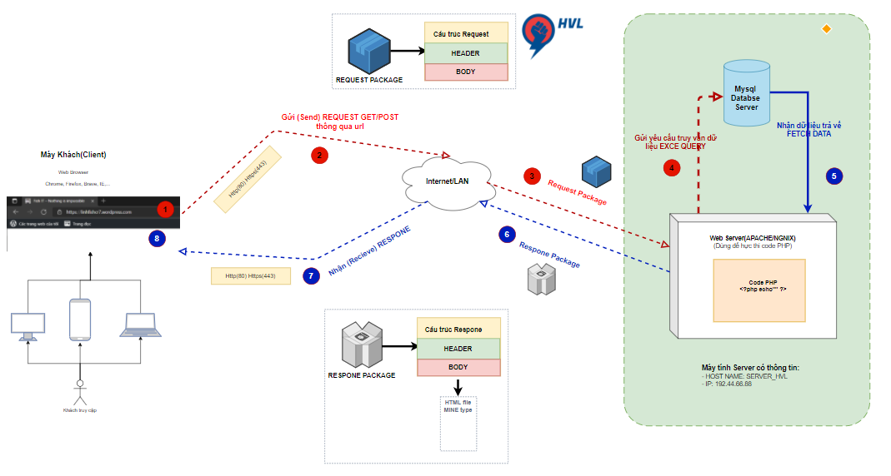

# Chương 1-Bài 1. Sơ đồ vận hành của một Website

## Sơ đồ hoạt động giữa Máy Khách (Client) và Máy Chủ (Server)

  

## Giải thích sơ đồ hoạt động
Trong thế giới web, thường sử dụng mô hình hoạt động giữa Máy chủ (Server) và Máy khách (Client). Hoạt động trao đổi giữa Máy chủ (Server) và Máy Khách (Client) đơn giản chỉ là: Máy Khách (client) -> gởi yêu cầu (Request) đến -> Máy Chủ (Server) Máy chủ (Server) xử lý -> và trả về phản hồi (Response) về Máy Khách (Client)

## Sơ đồ vận hành của một Website

  

## Giải thích sơ đồ hoạt động
Trong thế giới web, thường sử dụng mô hình hoạt động giữa Máy chủ (Server) và Máy khách (Client). Hoạt động trao đổi giữa Máy chủ (Server) và Máy Khách (Client) đơn giản chỉ là: Máy Khách (client) -> gởi yêu cầu (Request) đến -> Máy Chủ (Server) Máy chủ (Server) xử lý -> và trả về phản hồi (Response) về Máy Khách (Client) Lưu đồ thực hiện tuần tự như sau:

### Người dùng sử dụng chương trình duyệt web (Web Browser) - có thể là Chrome, Firefox, Cốc Cốc, Safari, ...

